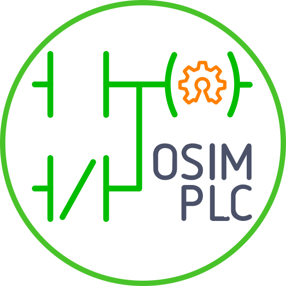

# OSIMPLC
<!-- {.massive-header.-with-tagline.center} -->
> Open Simple Modular PLC

* [Intro](docs/01-home.md)
* [MCU central module](docs/02-mcu.md)
* [Output modules](docs/03-outs.md)
* [Expansion modules](docs/04-expansions.md)
* [Interaction Module HMI](docs/05-hmi.md)
* [Programming and transference](docs/06-environments.md)
  * [LDmicro](docs/07-ldmicro.md)
  * [Other languages](docs/08-otherlangs.md)

* Manuals
  * [LDmicro manual](docs/LDmicro_manual.md)
  * [OBootLin manual](docs/OBootLin_manual.md)
  * [Download: How to...?](docs/downloads.md)

* [Downloads](docs/downloads_software.md)


```

   ||                                                                    ||
   ||        O                P                L                C        ||
 1 ||-------] [------+-------] [--------------]/[--------------( )-------||
   ||                |                                                   ||
   ||        S       |                                                   ||
   ||-------] [------+                                                   ||
   ||                |                                                   ||
   ||        I       |                                                   ||
   ||-------] [------+                                                   ||
   ||                |                                                   ||
   ||        M       |                                                   ||
   ||-------] [------+                                                   ||
   ||                                                                    ||
   ||                                                                    ||
   ||                                                                    ||
   ||------[END]---------------------------------------------------------||
   ||                                                                    ||
   ||                                                                    ||


```
