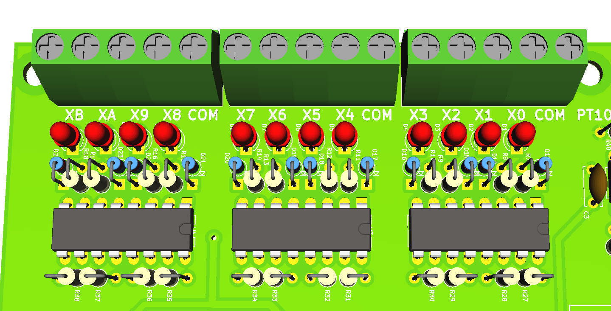
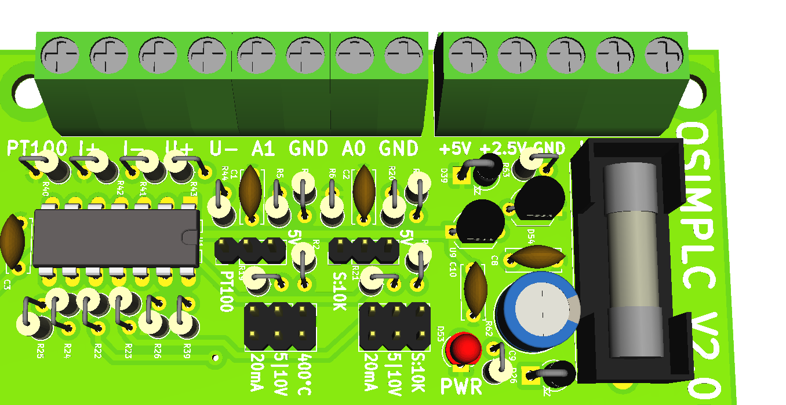

# CENTRAL MODULE MCU: MICRO CONTROLLER UNIT

The MCU module is the core of OSIMPLC; It has integrated inputs, connectors to output
modules, expansion modules, and various communication and programming modes.

The MCU module contains the microcontroller on board, in two easily interchangeable versions:

PIC16F887 (standard): can be programmed in Ladder language (IEC 61131-3) by means
of LDmicro, and also in BASIC, C and Assembler languages; applicable for solving simple
tasks;

PIC18F4520 (optional): can be programmed in BASIC, C and Assembler languages
(LDmicro does not support the PIC18F line). It offers twice capacity in memory for user
program and quadruple capacity in volatile memory (RAM) compared with PIC16F887;
applicable for solving relatively complex tasks.

## Power

One (1) input for 24Vdc / 12Vdc supply (range 11 ~ 27Vdc) with fuse and reverse polarity
protection, with LEDs signaling;
Three (3) reference voltage outputs: 0V; 2.5V (max 10mA); 5V (max 50mA); not protected.

## Inputs

Twelve (12) optocoupled digital inputs, PNP type (sink), in three groups of four inputs with
external reference terminal (can be used with independent power source); with LEDs
signaling;

Two (2) non-isolated analog inputs, configurable by means of jumpers in the 0-10V, 0-5V
or 0 (4) -20mA standards; one of them also configurable for connection of a PT100 probe
(provides 1 mA excitation), the other also configurable for NTC-10K temperature sensor
connection or LDR sensor.

## Outputs 

Twelve (12) digital outputs by optocouplers, very low current (max 15 mA), one of them
configurable as digital optocoupled or as not isolated PWM by means of jumpers, with
connectors for specialized output modules (three groups of four Departures); with LEDs
signaling.

> IMAGE?

## Expansion

Two (2) connectors for expansion modules; one for on-board modules (standard
expansions), and the other for external modules designed by the user or on request.

## Communication

One (1) half-duplex RS-485 port, available for connection to industrial instruments, other
programmable controllers and/or PC, LED signaling transmission mode;

One (1) UART-TTL connector, available for downloading the user program via bootloader
(Tiny Pic Bootloader) and/or monitoring from a PC using a USB-TTL converter, or HMI
Serial TTL module connection;

One (1) In Circuit System Programming (ICSP) connector for installing the bootloader, or
write and read user program and/or modify microcontroller configurations, using PIC
programmers such as USBPICPROG (Open Hardware + Free Software), PicKit2 or
others.

Machine code transferring to the OSIMPLC can be done through serial communication using a
bootloader and a USB-TTL converter connected to the UART pin-out, or by direct transferring
using a PIC programmer connected to the ICSP pin-out.

**OSIMPLC provides an USB-TTL programming cable as an accessory.**
==========

> **Note**
> The use of the ICSP connector is exclusive with the use of the outputs Y0-Y1; the use of the
> UART-TTL connector is exclusive with the connection of the RS-485 port.
