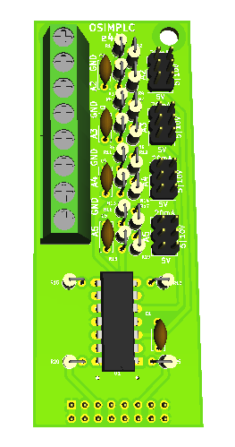
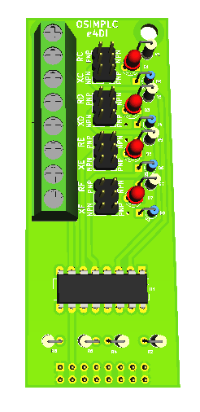
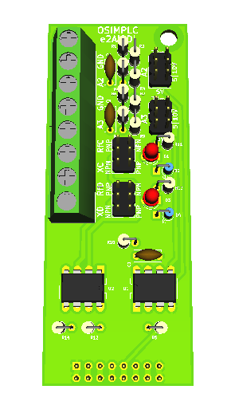
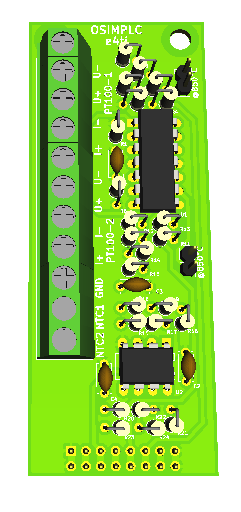
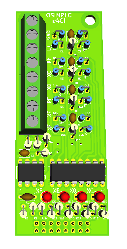
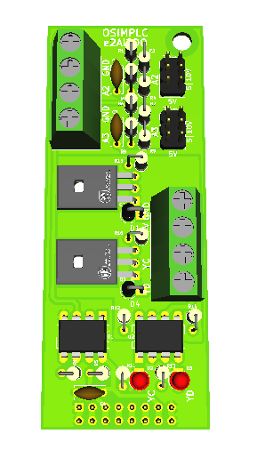
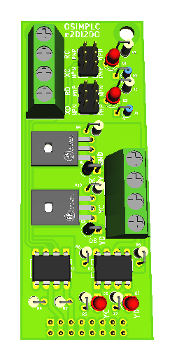

# MÓDULOS DE EXPANSIÓN

Los módulos de expansión a bordo permiten agregar más entradas y salidas al sistema,
llegando hasta configuraciones de 18E/12S, 16E/14S ó 14E/16S (30 puntos).
La mayoría de los módulos reciben alimentación desde el módulo MCU, con excepciones en
ciertos módulos especializados.

## MÓDULOS DE ENTRADAS

### E4AI

Cuatro (4) entradas analógicas normalizadas, configurables individualmente en las
normas 0-10V, 0-5V ó 0(4)-20mA por medio de jumpers.

### E4DI

Cuatro (4) entradas digitales, configurables individualmente como PNP (sink) o NPN
(source) por medio de jumpers, señalizadas por LEDs.

### E2AI2DI

Dos (2) entradas analógicas normalizadas, configurables individualmente en las normas 0-
10V, 0-5V ó 0(4)-20mA por medio de jumpers; más dos (2) entradas digitales,
configurables individualmente como PNP (sink) o NPN (source) por medio de jumpers,
señalizadas por LEDs.

### E4TI

Expansión especializada para sensado de temperatura.

Dos (2) entradas para conexión de sondas PT100 (provee excitación de 1 mA para cada
una de ellas); más dos (2) entradas para conexión de sondas NTC-10K.

### E4CI

Expansión especializada para detección de líquidos conductivos.

Cuatro (4) entradas digitales de muy baja corriente en CA, señalizadas por LEDs; provee
tensión de excitación en 12 Vca @ 900 Hz (minimizando la hidrólisis) por medio de bornes
para conexión de electrodos de referencia. Las señales enviadas al microcontrolador
están invertidas respecto a la detección del líquido.

> **Atención**: este módulo requiere alimentación externa en 24Vcc; puede compartir la
> alimentación con el módulo MCU, o utilizar fuente independiente.

## MÓDULO DE SALIDAS

### E4DO

Cuatro (4) salidas a transistor NPN colector abierto, Umax: 24 Vcc; Imax: 200 mA carga
resistiva, 100 mA carga inductiva, señalizadas por LEDs (ver Nota).

## MÓDULOS MIXTOS DE ENTRADAS Y SALIDAS

### E2AI2DO

Dos (2) entradas analógicas normalizadas, configurables individualmente en las normas 0-
10V, 0-5V ó 0(4)-20mA por medio de jumpers; más dos (2) salidas a transistor NPN
colector abierto, Umax: 24 Vcc; Imax: 200 mA carga resistiva, 100 mA carga inductiva,
señalizadas por LEDs (ver Nota).

### E2DI2DO

Dos (2) entradas digitales, configurables individualmente como PNP (sink) o NPN (source)
por medio de jumpers, señalizadas por LEDs; más dos (2) salidas a transistor NPN
colector abierto, Umax: 24 Vcc; Imax: 200 mA carga resistiva, 100 mA carga inductiva,
señalizadas por LEDs (ver Nota).

> **Nota**:
> Los módulos de expansión no disponen de fusibles de protección en sus salidas individuales,
> los que deberán ser instalados externamente por el usuario.

Las salidas cuentan con protecciones limitadas contra sobretensiones en alimentación y picos
de tensión inversa originados por la desconexión de cargas inductivas; el usuario deberá
instalar las protecciones adicionales correspondientes a cada tipo de cargas (red RC, varistor,
para cargas en CA; diodo de de rueda libre para cargas en CC).
