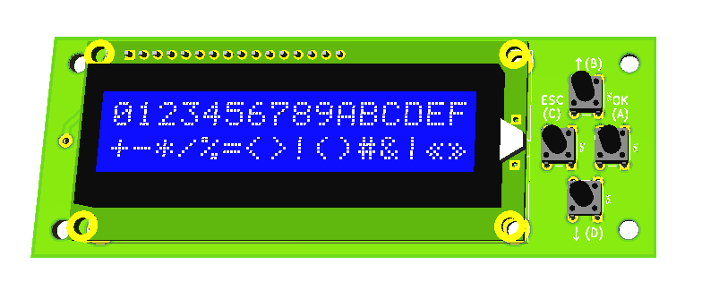

MÓDULO HMI
==========

El módulo HMI (Human Machine Interface) está diseñado para facilitar la interacción del usuario
con el automatismo; permite mostrar mensajes de texto para alarma o información, estados de
entradas y salidas digitales, variables numéricas (valores escalados de entradas analógicas,
temporizadores, contadores, variables internas, etc.), efectuar modificaciones en los
parámetros de trabajo, y ejecutar comandos de control.

Consiste en un display LCD de 2 filas por 16 caracteres con retroiluminación y de cuatro
pulsadores programables, no dispone de memoria propia; y se comunica con el módulo MCU
por medio de bus serial TTL, siendo apto para ser montado a corta distancia del OSIMPLC, p.
ej. en el frente de gabinete.

La interacción entre el módulo MCU y el módulo HMI se controla por medio de operaciones
UART en norma 96008N desde el programa de usuario cargado en el microcontrolador,
soportando un subconjunto básico de comandos seriales tipo Matrix Orbital.

En caso de estar instalado en el módulo MCU el microcontrolador PIC16F887 y de
desarrollarse la programación bajo Ladder con el software LDmicro, su capacidad de
interacción será considerablemente limitada, debiendo ser cuidadosamente optimizada por el
programador.

Las posibilidades de interacción se verán notablemente incrementadas en caso de instalarse
en el módulo MCU el microcontrolador PIC18F4520 y realizarse la programación en BASIC, C
o Assembler, aprovechando bibliotecas y funciones especializadas disponibles en dichos
lenguajes.

> **NOTA**:
> El módulo HMI no es un panel de operador (OP) de tipo industrial; no dispone actualmente de
> envolvente o gabinete con grado de protección IP (en desarrollo).
